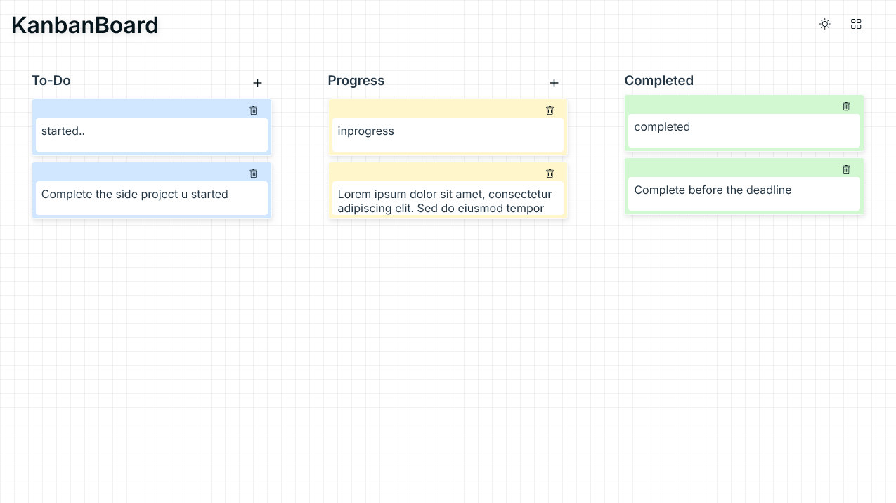
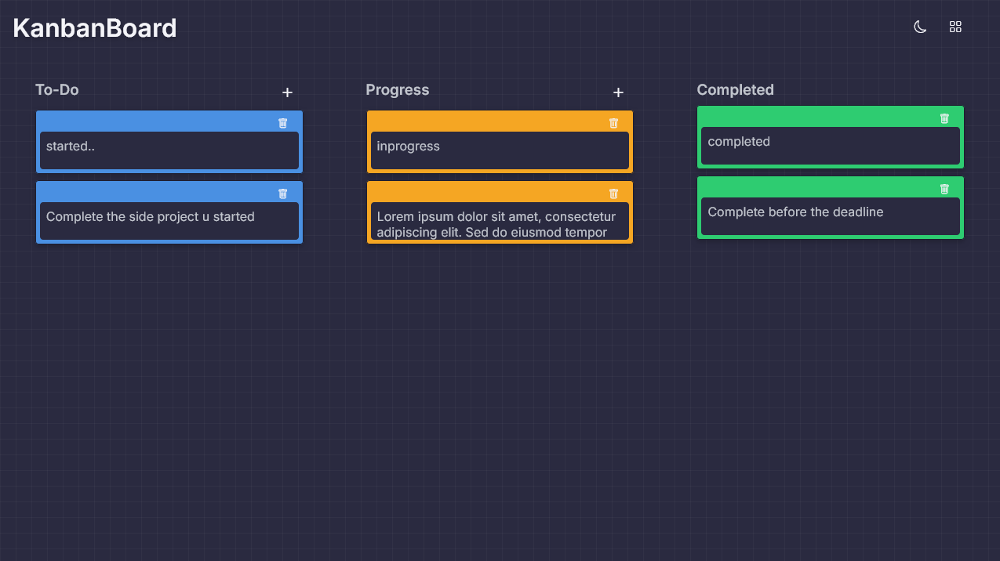

# 🧩 Kanban Board

A simple, responsive, and fully functional **Kanban Board** built with **vanilla JavaScript**, **HTML**, and **CSS**. It features drag-and-drop task management, localStorage persistence, dark mode, and a grid overlay toggle for better alignment.

---

## ✨ Features

- 📝 **Create Tasks** in "To-Do", "Progress", or "Completed" columns.
- 🔃 **Drag and Drop** tasks between columns.
- 💾 **LocalStorage Persistence** – your tasks stay saved even after refreshing.
- 🗑️ **Delete Tasks** with a single click.
- 🌙 **Dark/Light Mode** toggle.
- 🔳 **Grid Overlay** toggle to assist with layout design.
- 📱 **Responsive Design** – works well on all screen sizes.

---

## 📁 Project Structure

```bash
kanban-board/
│
├── index.html          # Main HTML structure
├── style.css           # All styles (light & dark mode, responsive)
├── script.js           # Functionality & interactivity
├── assets/             # Folder to store screenshots and icons
│   ├── screenshot-light.png
│   └── screenshot-dark.png
└── README.md           # Project documentation
```

---

## 🚀 Getting Started

### 1. Clone the Repository

```bash
git clone https://github.com/Rax498/kanban-board.git
cd kanban-board
```

### 2. Open in Browser

Just open `index.html` in your favorite browser:

```bash
open index.html
```

> ✅ No build step, no dependencies. Everything runs directly in the browser.

---

## 📸 Screenshots

### 🖼 Light Mode


### 🌙 Dark Mode


---

## 🛠 How It Works

### Task Creation

- Each column has an "Add" (`+`) button.
- Tasks are added as editable `<textarea>` elements.
- Unique IDs are generated using `Date.now()`.

### Task Updates

- Task descriptions are saved instantly (`oninput`) to localStorage.

### Task Deletion

- Clicking the trash icon removes the task both from the DOM and localStorage.

### Drag and Drop

- Tasks are draggable and sortable inside and between columns.
- After drop, task positions are updated and persisted.

### LocalStorage Schema

```json
{
  "To-Do": [
    { "id": "abc123", "des": "Task 1" }
  ],
  "Progress": [],
  "Completed": []
}
```

---

## 🎨 Customization

You can easily modify:

- **Column names** → in `index.html`
- **Color themes** → in `:root` and `.dark` CSS variables
- **Default height & behavior** of textareas

---

## 🌐 Live Demo

[🔗 View Live Project](https://rax498.github.io/kanban-board/)


---

## 📋 To-Do / Improvements

- [ ] Add task due dates and labels
- [ ] Implement backend syncing (Firebase, Supabase, etc.)
- [ ] Drag to reorder within columns (currently only top-to-bottom drop)
- [ ] Add animations to drag/drop actions
- [ ] Export/import board as JSON

---

## 👨‍💻 Author

**Your Name**  
[GitHub](https://github.com/Rax498) • [LinkedIn](https://linkedin.com/in/rakesh-087a13172)

---

## 📄 License

This project is licensed under the [MIT License](LICENSE).

---

## 🙌 Acknowledgements

- Icons from [Bootstrap Icons](https://icons.getbootstrap.com/)
- Fonts from [Google Fonts - Inter](https://fonts.google.com/specimen/Inter)
